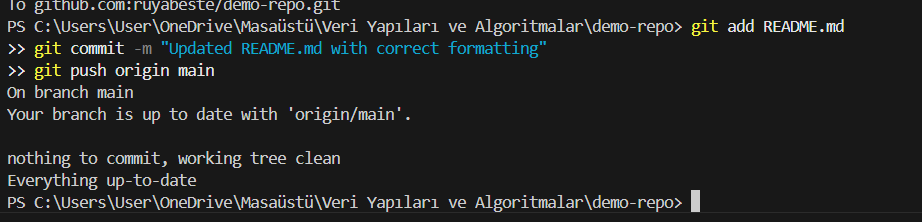
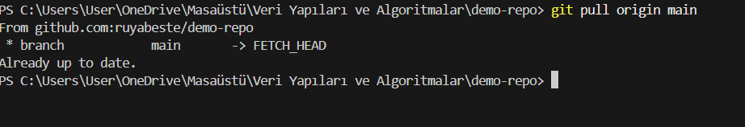
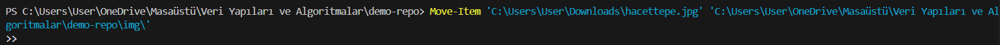
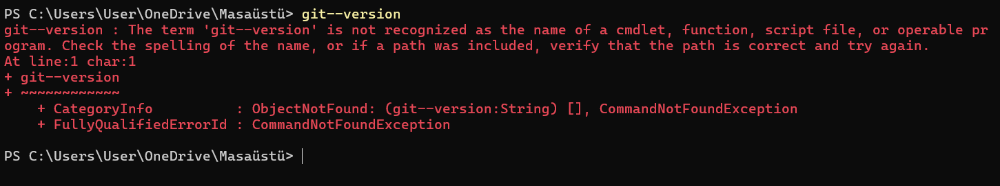
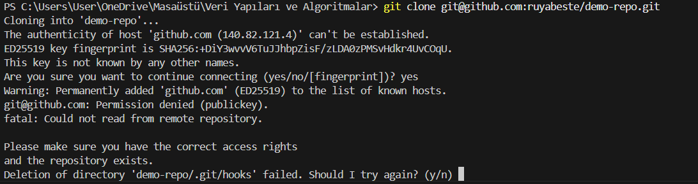

# Assignment #2 – Git/GitHub

This file is created as part of Assignment #2 to document the process of using Git and GitHub. It includes the Git commands we used, the differences between working locally and on GitHub, the challenges faced, and how AI helped along the way.

---

## **1. Git Commands Used**

| Command                                           | Description                                                 |
| ------------------------------------------------- | ----------------------------------------------------------- |
| `git clone <repo_url>`                            | Clones a remote repository to local machine                 |
| `git init`                                        | Initializes a new Git repository                            |
| `git add .`                                       | Stages all changes for commit                               |
| `git commit -m "message"`                         | Commits the staged changes with a message                   |
| `git push origin main`                            | Pushes committed changes to GitHub                          |
| `git pull origin main`                            | Fetches the latest changes from the remote repository       |
| `git status`                                      | Checks the status of the working directory and staging area |
| `git config --global user.name "Your Name"`       | Sets the global Git username                                |
| `git config --global user.email "your@email.com"` | Sets the global Git email                                   |

---
📌 Some examples of commands I used in this assignment :
- **The command updates the README.md file by staging the changes, committing them with a message, and pushing them to the main branch on GitHub**.



- **The git pull origin main command is used to fetch and merge the latest changes from the remote repository's main branch into the local repository**.



---

## **2. Additional Commands Used for This Assignment**

| Command                   | Description                                      |
| ------------------------- | ------------------------------------------------ |
| `Get-Content <file>`      | Displays the contents of a file                  |
| `Set-Content <file>`      | Overwrites the content of a file                 |
| `Add-Content <file>`      | Appends content to a file                        |
| `Remove-Item <file>`      | Deletes a file                                   |


---
📌 Some examples of commands I used in this assignment : 
- **The command Add-Content coordinates.csv was used to append a new location entry to the coordinates.csv file without overwriting its existing content**.


- **The command Move-Item moves the file hacettepe.jpg from the Downloads folder to the img directory inside the demo-repo project**.
  


---


## **2. Difference Between Local Git Workflow and GitHub Workflow**

- **Local Git Workflow**:

  - Changes are made on the local machine.
  - Commits are stored in a local repository.
  - No online collaboration unless pushed to a remote repository.

- **GitHub Workflow**:

  - Acts as a remote repository for backup and collaboration.
  - Allows multiple contributors to work on the same project.
  - Requires `git push` to update changes to the cloud.
  - `git pull` is used to sync changes from the remote repository to the local machine.

---

## **3. Difficulties Encountered**

During this process, some challenges were faced, including:

- **Git installation issues**, where the command was not recognized until properly set up.
- **SSH authentication problems**, which required generating and configuring SSH keys.
- **Locked files in VS Code**, preventing modifications to `coordinates.csv`.
- **Accidental duplicate data**, which had to be manually cleaned up.

### **🛑 Some Errors I Encountered**
Below are some errors I encountered during this assignment along with their solutions.

📌 **Screenshot of the error:**


- **Reason:** Git is installed but **not added to the system PATH**.
- **Solution:**
  - **Check if Git is installed:**
    ```powershell
    git --version
    ```
  - If the command is not recognized:
    1. **Reinstall Git.** ([Download Git](https://git-scm.com/downloads))
    2. **Restart your computer.**
    3. **Run the command again.**
    4. If the issue persists, **manually add Git's installation directory to the system PATH**.

📌 **Screenshot of the error:**

- **Reason:** SSH keys are either not configured or **not properly added to GitHub**.
- **Solution:**
  - **Check if an SSH key exists:**
  ```powershell
  ls ~/.ssh
  ```
  - If no SSH key is present, generate one using:
  ```powershell
  ssh-keygen -t rsa -b 4096 -C "your-email@example.com"
  ```
  - Add the SSH key to GitHub:
    1. Copy the SSH key:
    ```powershell
    cat ~/.ssh/id_rsa.pub
    ```
    2. Go to GitHub → Settings → SSH and GPG keys → Add a new SSH key.
    3. Paste the copied key and save.
    Now you can test the SSH connection:
    ```powershell
    ssh -T git@github.com
    ```
---

## **4. When I Decided to Make a Commit**

I decided to make commits at important stages to keep track of progress and avoid losing work:

- After setting up the Git repository.
- After adding new locations to the `coordinates.csv` file.
- After fixing errors, like duplicated entries.
- Whenever I made significant changes that needed to be saved.

---

## **5. AI Assistance & Benefits**

AI was really helpful in this project, especially for:

- **Debugging Git errors** and finding solutions quickly.
- **Providing correct Git commands** when I was unsure about the syntax.
- **Helping with this README.md file**, making it more structured and clear.
